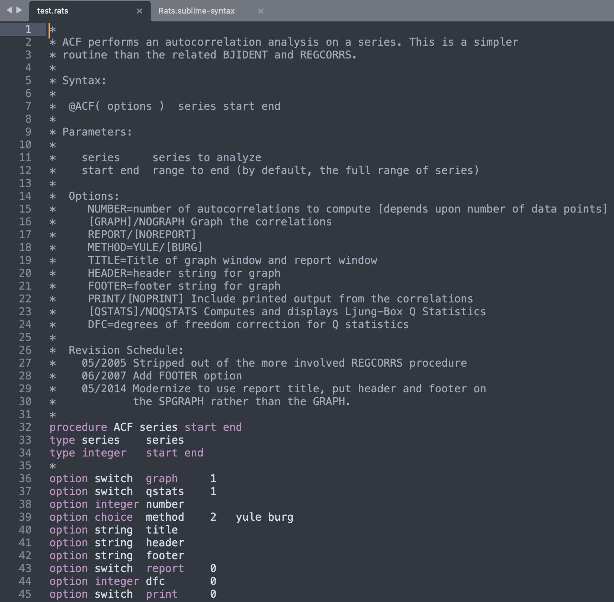

# Rats-Syntax-Highlighting
Simplified syntax highlighter for [RATS (Estima)](https://www.estima.com/ratsmain.shtml) and compatible with Sublime Text.  



## How to install
1. Download [Sublime Text](http://www.sublimetext.com/).
2. Open the `Rats.sublime-syntax` file with Sublime.
3. Now open the Sublime Console with `View > Show Console` or press the associated key binding. You'll see that the last line in the console is this:

```generating syntax summary```

4. When you restart Sublime you should see the option for `Rats`in `View > Syntax`. It should also be visible when you click on the bottom right corner of an open document tab where the file type is declared.

## Licence
Copyright 2021 by Alex Ribeiro-Castro.

Permission is hereby granted, free of charge, to any person obtaining a copy of this software and associated documentation files (the "Software"), to deal in the Software without restriction, including without limitation the rights to use, copy, modify, merge, publish, distribute, sublicense, and/or sell copies of the Software, and to permit persons to whom the Software is furnished to do so, subject to the following conditions:

THE SOFTWARE IS PROVIDED "AS IS", WITHOUT WARRANTY OF ANY KIND, EXPRESS OR IMPLIED, INCLUDING BUT NOT LIMITED TO THE WARRANTIES OF MERCHANTABILITY, FITNESS FOR A PARTICULAR PURPOSE AND NONINFRINGEMENT. IN NO EVENT SHALL THE AUTHORS OR COPYRIGHT HOLDERS BE LIABLE FOR ANY CLAIM, DAMAGES OR OTHER LIABILITY, WHETHER IN AN ACTION OF CONTRACT, TORT OR OTHERWISE, ARISING FROM, OUT OF OR IN CONNECTION WITH THE SOFTWARE OR THE USE OR OTHER DEALINGS IN THE SOFTWARE.
